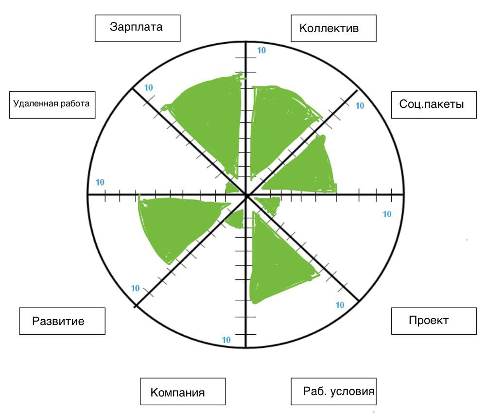
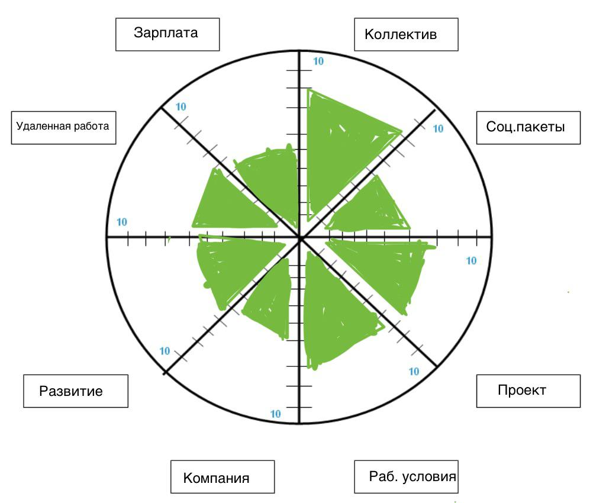
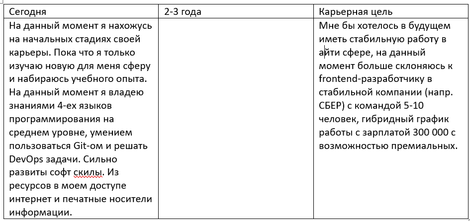

<h1>Exercise 00</h1>
<h2>Сейчас</h2>
    

1. Зарплата - 8

2. Коллектив - 7

3. Социальные пакеты - 6

4. Проект - 2

5. Рабочие условия - 7

6. Компания - 2

7. Развитие - 7

8. Удаленная работа - 1

<h2>Через 5 лет</h2>
    

1. Зарплата - 5

2. Коллектив - 8

3. Социальные пакеты - 5

4. Проект - 7

5. Рабочие условия - 7

6. Компания - 6

7. Развитие - 5

8. Удаленная работа - 6

<h2>Шаги действия</h2>

Зарплата - В первую очередь нужно развивать востребованные навыки, повышать свою ценность на рынке, также исследовать рыночные зарплаты для своей профессии и уровня опыта.

Коллектив - всегда стоит анализировать отзывы сотрудников о компании перед трудоустройством. Нужно уметь налаживать рабочие отношения и быть открытым к обратной связи, развивать навыки эмпатии и комманикации. 

Социальные пакеты - при устройстве на работу уточнять условия ДМС, отпусков, бонусов и т.д. Следить за изменениями в законодательстве, касающимися прав работников. 

Проект - опредилить для себя, какие проекты наиболее интересны и соответствуют мои карьерным целям. 

Рабочие условия - Узнать о наличии комфортного рабочего пространства и оборудования на собеседовании. 

Компания - составить список компаний чьи ценности и репутация мне близки. Не мало важно изучать отзывы сотрудников, рейтинги и корпоративную культуру интересующих компаний

Развитие - составить план профессионального и личного развития. Ежемесячно выделять время для обучения новым навыкам. Регулярно саморефлексировать.

Удаленная работа - развивать навыки, востребованные для удаленной работы. Создать комфортное рабочее место дома с минимальными отвлекающими факторами. Развить дисциплину и самоорганизацию для высокопродуктивной работы.

<h1>Exercise 01</h1>
