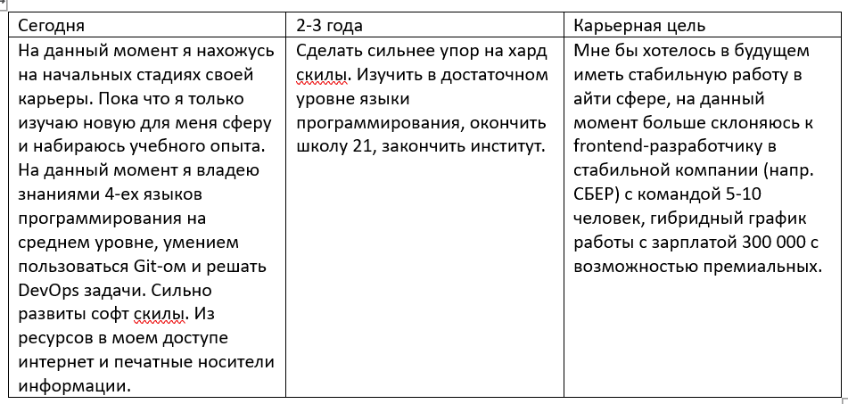
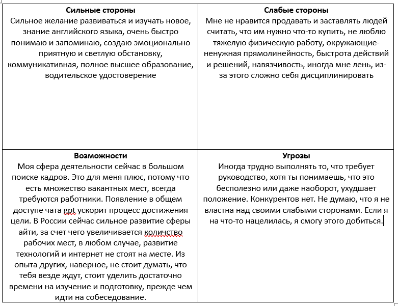

<h1>Exercise 00</h1>
<h2>Выбор компании</h2>

1. **Репутация компании**  
   - Проверить отзывы сотрудников на сайтах.  
   - Убедиться, что компания работает легально и прозрачно.  

2. **Корпоративная культура**  
   - Выяснить, ценит ли компания развитие сотрудников, обратную связь и баланс между работой и личной жизнью.  
   - Узнать о поддержке сотрудников в сложных ситуациях.  

3. **Финансовая стабильность**  
   - Оценить, как долго компания существует на рынке.  
   - Узнать о последних финансовых результатах, если информация доступна.  

4. **Уровень заработной платы**  
   - Соответствует ли предложенная зарплата рыночным условиям для вашей профессии.  
   - Есть ли возможности для пересмотра дохода.  

5. **Социальные льготы**  
   - Наличие ДМС, оплачиваемого отпуска, больничных, компенсаций за спорт, питание и транспорт.  

6. **Перспективы роста**  
   - Есть ли карьерные пути внутри компании.  
   - Предлагает ли компания внутренние или внешние тренинги, поддержку профессионального развития.  

7. **Проекты и задачи**  
   - Интересны ли задачи и соответствуют ли они вашим профессиональным амбициям.  
   - Предоставляет ли компания ресурсы для их выполнения.  

8. **Гибкость рабочего графика**  
   - Возможна ли удалённая работа или гибкий график.  
   - Насколько руководство поддерживает автономность сотрудников.  

9. **Местоположение офиса**  
   - Удобно ли добираться до офиса, если работа не удалённая.  
   - Есть ли инфраструктура рядом (кафе, спортзалы, парковка).  

10. **Рабочая среда и условия труда**  
   - Современное оборудование и комфортное рабочее пространство.  
   - Поддерживает ли компания инклюзивность и равные права.  

**Компании**

Сбер, Тинькофф, ВК, Яндекс, Ozon, Google (Alphabet), Tesla

**Вакансии**

Тинькофф - Руководитель команды фронтенда (https://ict.moscow/news/vakansii-27082019/?utm_source=chatgpt.com)

Яндекс - Разработчик Python (https://ict.moscow/news/vakansii-27082019/?utm_source=chatgpt.com)

Ozon -  Разработчик Java
(https://ict.moscow/news/vakansii-27082019/?utm_source=chatgpt.com)

<h1>Exercise 01</h1>

<h2>Анализ вакансий</h2>

[Таблица с анализом вакансий](https://docs.google.com/spreadsheets/d/1C6xe_KXTE8H7ifZ9kSJHhiEVdDGEbpfNGtUAfBb8GjU/edit?usp=sharing)

 
 

<h1>Exercise 02

</h1>
<h2>Анализ навыков</h2>
 
