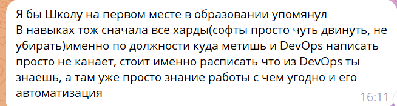

<h1>Exercise 00</h1>
<h2>Твое резюме</h2>

Резюме находится в папке src

<h1>Exercise 01</h1>
<h2>Проверка резюме</h2>

 
Я добавила Школу и расписала конкретнее свои навыки и знания в этой сфере

<h1>Exercise 02</h1>
<h2>Сопроводительное письмо
</h2>

Здравствуйте, (Имя HR-менеджера),

Меня зовут Лебедева Ирина, и я хотела бы подать заявку на вакансию Junior DevOps инженера, которую я нашела на (сайт или источник вакансии).

Ваши проекты и возможности для профессионального роста привлекли мое внимание. Я вижу, что ваша компания активно развивает инновационные подходы к автоматизации и оптимизации процессов, что полностью соответствует моим интересам и карьерным целям. Могу предложить свою готовность к быстрому обучению, умение работать с Linux, Docker, CI/CD и настройкой сетей, а также страсть к развитию в сфере DevOps. Я уверена, что мои навыки и стремление развиваться помогут внести значительный вклад в ваши проекты.

Мои сильные стороны — это ответственность, умение работать в команде и быстро обучаться новым инструментам и технологиям. Я всегда готова брать на себя дополнительные задачи и выходить за рамки своих обязанностей, чтобы достичь общих целей. Я уверена, что моя позитивная энергия и готовность решать сложные задачи будут полезны для вашей команды.

Я с радостью приму участие в конкурсе на эту вакансию и буду рада обсудить, как могу быть полезна вашей компании.

Мои контактные данные: 8 (995) 368-25-70 и iroslavie@gmail.com.

С уважением,

Лебедева Ирина.

