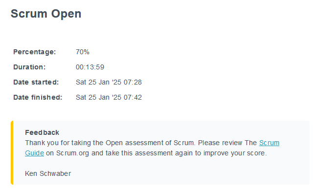
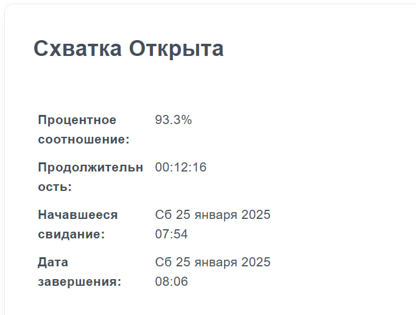
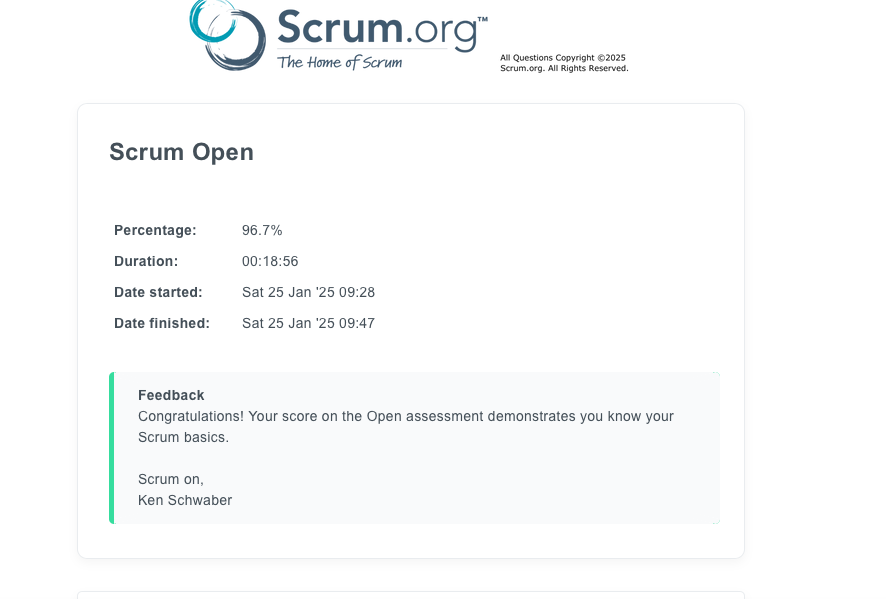

## Exercise 00 
### Создание и ведение командной доски с задачами обучения  

[Ссылка на доску](https://tracker.yandex.ru/agile/board/1)

## Exercise 01
### Проведение командной ретроспективы 

[Ссылка на запись встречи](https://drive.google.com/file/d/1NSLe_lDi9w6zYHO7CzeBNImZUsy_1pTL/view?usp=sharing)

[Ссылка на интерактивную доску](https://metroretro.io/BO194NPDXGZR)

## Exercise 02
### Сдача ассесмента по SCRUM 

<figcaption>mayolaty</figcaption>
 
 
 
 
 

<figcaption>laurettw</figcaption>
 
 
 
 
 

<figcaption>giantjen</figcaption>
